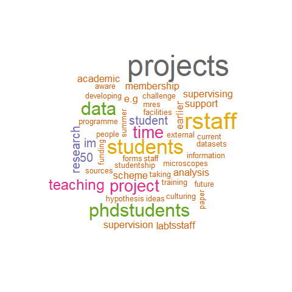
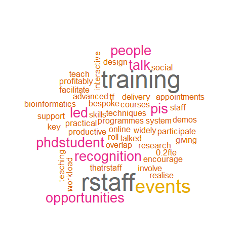
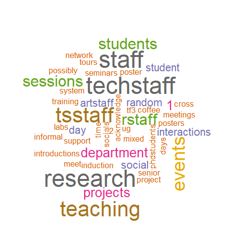

```{r setup, include=FALSE}
knitr::opts_chunk$set(echo = FALSE,
                      message = FALSE,
                      warning = FALSE)
options(gargle_oauth_email = "emma.rand@york.ac.uk")
```

```{r}
library(tidyverse)
library(googlesheets4)
library(kableExtra)
```

```{r}
url <- "https://docs.google.com/spreadsheets/d/1XTMw6wkvgXiefBgOFnegOl6XBLUNFZBSbx1qqo9hwu8/edit?resourcekey#gid=95266269"
responses <- read_sheet(url, )
```
# Summary of responses


```{r}
response_summary <- responses %>% 
  group_by(`Which theme were you?`) %>%
  count()  
response_summary$summary = c("Research Staff already do a lot of supervison on behalf of their PIs. Make this 'official' to recognise post-doc contribution, provide training in supervision and info about ug degree programmes and esp projects, send student feedback to research staff supervisors. More advice of use of teaching facilities for projects. Possible bulk training in lab techniques for project students. Requires PI support. Requests for training in R/bioinformatics for post-docs to faciliate project supervison in these areas. Requests for systems/event to link up T&S and Reaseach staff -  database? More events like this. Recognise different models of co-supervision. Praise for new studentship scheme - expand, help with identifying funding sources for post-docs wishing to offer summer placments. Document ug contributions research.",
                             "This theme was sometimes interpreted as 'what training do our post-docs want'. Bioinformatics, programming, practical demos of advanced techniques, bespoke training. Other suggestions were to increase the events like this where staff mix and an increase in phd student-led and post-doc-led events; have a system to help people find each other/key skills. post-docs could/would like be invloved in training delivery but need PI support and recognition. ",
                             "More events like this, more socials and research events that 'force' people to mix. Buddy system? Shadowing in both both directions? Meet ups of all sci comms ug project staff and students Put post events in departmental calender, rebadge as socials with posters? More structured events for technical staff. Pump priming to promote interaction (1-2k for across-staff projects). Expand summer studentship programme with 1 or 2 projects dedicated to staff group collaborations.. One suggestion that T&S staff should run ART staff projects")
```

```{r}
resp <- response_summary$`Which theme were you?`
groups <- sum(response_summary$n)
```

Feedback was received from `r groups` groups on three themes:: `r resp`   


```{r}
response_summary %>% 
  knitr::kable(caption = "Theme summaries",
               col.names = c("Theme", "Number of groups", "Summary of discussion"),
               align = c("l", "c", "l")) %>% 
  column_spec(1, width = "30%") %>% 
  column_spec(2, width = "20%") %>% 
  column_spec(3, width = "50%") 
                        
```

# Wordclouds

```{r}
tibble(Abbreivation = c("rstaff",
                        "tsstaff",
                        "artstaff",
                        "techstaff"),
       Meaning = c("Research staff",
                   "T&S Staff",
                   "ART Staff",
                   "Technical Staff")) %>% 
  knitr::kable(caption = "Key") %>% 
  column_spec(1, width = "30%" ) %>% 
  column_spec(2, width = "30%")
```


## A. How can all staff work together to improve the UG/PGT student research experience and outcomes? {-}
```{r}

```


## B. How can all staff work together to improve professional training programmes?  {-}
```{r}

```

## C. Strategically, how do we create more interactions between staff groups?  {-}
```{r}

```


